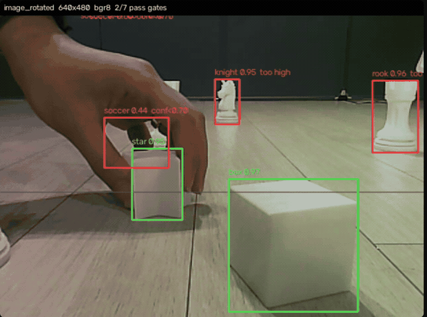
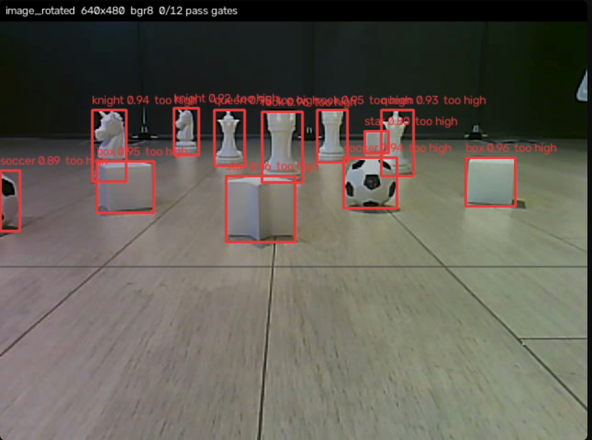
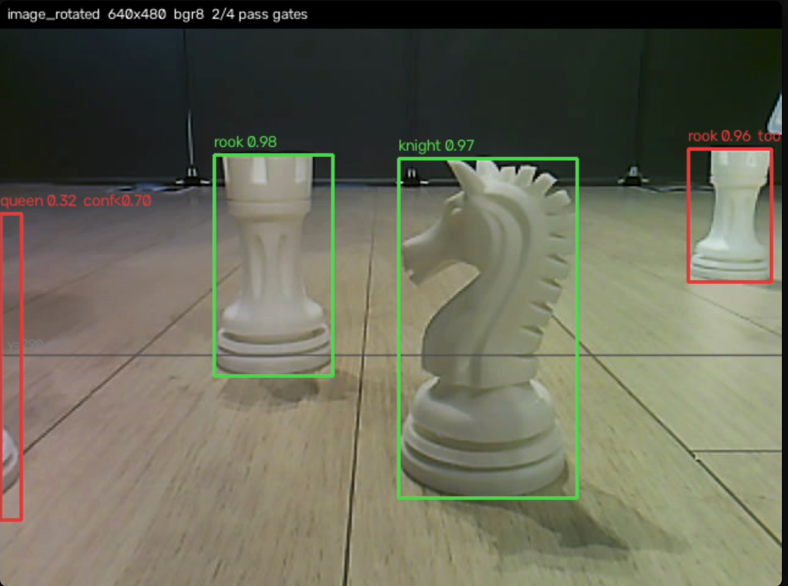

# Grippers 인지 파이프라인 — 합성 데이터에서 엣지 추론까지

> 실사진 **0장**으로 학습 데이터를 만들고, Intel Geti·YOLO11n·Hailo-10H 를 거쳐
> 로봇 위에서 도는 검출기까지 만든 과정. 그리고 **검출된 것을 그대로 믿지 않기 위해
> 붙인 게이트**의 설계와 실측.
>
> 상위 시스템 문서: [Grippers — ROS 2 분산 모바일 매니퓰레이터](grippers.md)

**팀**: Grippers (Intel AI for X · Seoul SeSAC) — 김동혁 · 조현우 · 김희수
**제출**: Intel AI Festival 중간보고 (2026-08-24)

---

## 1. Problem — 데이터가 없다

작업 대상은 체스말 3종(`knight`/`queen`/`rook`)과 장난감 3종(`box`/`soccer`/`star`),
총 6클래스다. 분류 기준이 **색이 아니라 모양**이다 — 전부 흰색 계열이라 색 규칙으로는
갈라지지 않는다.

문제는 두 가지였다.

1. **촬영·라벨링 비용.** 6클래스 × 다양한 배치 × 조명을 손으로 찍고 박스를 치는 것은
   교육과정 기간 안에 감당이 안 된다.
2. **시점이 바뀌면 데이터가 통째로 죽는다.** 카메라를 오버헤드(C920)에서 로봇 뎁스캠으로
   옮기는 순간, 오버헤드로 찍어 둔 데이터셋의 가치가 급감한다. 로봇 시점은 바닥에 붙어
   있어서 원근·가림·크기 분포가 완전히 다르다.

## 2. Approach — Houdini 로 장면을 "다시 생성"한다

사진을 찍는 대신 **3D 툴(Houdini)에서 작업 환경을 절차적으로 세팅하고 렌더링**했다.

```
3D 에셋  →  랜덤화된 장면  →  로봇 시점 렌더  →  자동 라벨
```

핵심은 라벨이 **공짜**라는 것이다. 물체를 배치한 주체가 렌더러이므로, 각 물체의 화면상
경계는 계산으로 나온다. 사람이 박스를 칠 일이 없다.

그리고 이 방식의 진짜 이점은 위 2번 문제에 있다 — **시점이 바뀌면 다시 찍는 게 아니라
다시 렌더한다.** 가상 C920 시점, 로봇 POV 시점을 같은 씬에서 뽑아낼 수 있다.

> 렌더된 아레나 씬에는 바닥 4모서리의 ArUco 마커까지 포함되어 있다 — 좌표계 검출도
> 같은 데이터로 함께 준비된다.

**Domain gap 은 남는다.** 렌더 이미지로만 학습한 모델이 실제 조명·센서 노이즈에서
어떻게 무너지는지는 아래 6장에서 실측으로 다룬다.

## 3. Pipeline — 데이터에서 디바이스까지

```
HOUDINI          INTEL GETI        OPENVINO          HAILO-10H + CPU
절차적 장면   →   객체 검출 학습  →  모델 최적화    →   HEF 가속 / NCNN 폴백
자동 라벨          평가              엣지 검증           온디바이스 추론
```

Geti 는 No-Code 로 검출 모델을 돌려 보고 데이터셋 품질을 빨리 판정하는 자리에 썼다.
(같은 도구를 별도 과제에도 적용했다 — [Intel Geti F1 차량 분류](geti-f1-classification.md))

최종 배포는 Ultralytics YOLO11n 으로 갔다.

## 4. 두 개의 모델 — 프로토타입과 배포본

두 산출물이 남아 있고, **차이 자체가 기록**이다.

| | 프로토타입 (Hailo) | 배포본 (`best.pt`) |
|---|---|---|
| 날짜 | 2026-08-21 | 2026-08-26 |
| 백본 | YOLO11n | YOLO11n |
| 입력 | **1152 × 1152** | **640 × 640** |
| 클래스 | **7** — `container` 포함 | **6** — `container` 삭제 |
| 데이터 사용량 | `fraction: 0.6` | `fraction: 1.0` |
| 학습 | — | 300 epoch · batch 128 · patience 50 · lr0 0.01 |
| 증강 | — | mosaic 1.0 (close 10) · scale 0.5 · fliplr 0.5 · degrees 0.0 |
| 양자화 | **INT8**, `hailo_arch: hailo10h` | 없음 (FP) |
| NMS | 온칩 (conf 0.05 / IoU 0.7, 클래스당 100) | 런타임 |
| 산출물 | `best.hef` (5.0 MB) | `best.pt` (5.2 MB) |

읽는 법:

- **1152 → 640.** 큰 입력은 먼 물체에 유리하지만 지연을 그만큼 낸다. 뒤에 게이트로
  가까운 물체만 받기로 정하면서, 먼 물체 해상도에 지불할 이유가 사라졌다.
- **`container` 삭제.** 바구니를 검출로 찾는 설계를 접고 **LiDAR 거리로 판정**하는 쪽으로
  옮겨 갔다. 클래스 하나를 지운 게 아니라 센서 책임 분담을 바꾼 것이다.
- **`degrees: 0.0`.** 회전 증강을 껐다. 뎁스캠 영상은 `depth_cam_rotate_node` 가 이미
  고정 각도로 세워 주므로, 학습 때 임의 회전을 넣으면 없는 불변성을 배우게 된다.
- **`fraction: 0.6 → 1.0`.** 프로토타입은 컴파일 파이프라인이 도는지만 보면 됐으므로
  데이터의 60%만 썼다.

## 4.5 세 번째 모델 — 탑뷰는 클래스가 **하나**다

로봇 탑재 모델과 별개로, 아레나 오버헤드(C920 2대)용 검출기가 따로 있다.
같은 물체를 보는데 **클래스가 6개가 아니라 1개(`object`)**다.

| | 로봇 POV | 탑뷰 (ArUco_C920) |
|---|---|---|
| 클래스 | 6종 (knight/queen/rook/box/soccer/star) | **1종 (`object`)** |
| 데이터 | Houdini 합성 | **실촬영 171쌍 = 342장** |
| 목적 | 무엇을 집을지 결정 | 어디에 무엇이 **있는지** |
| 물체 크기 | 화면의 상당 부분 | **30–45 px** |

**왜 종류를 구분하지 않는가.** 탑뷰의 임무는 "여기 뭔가 있다"까지다. 그것이
나이트인지 룩인지는 로봇이 코앞까지 가서 자기 카메라로 판정한다. 멀리서 30 px 로
찍힌 흰 물체의 종류를 억지로 맞히려 들면 오분류만 늘고, 그 오분류가 경로 계획에
그대로 들어간다.

### 라벨링 규칙서 — 규칙보다 **근거**를 적었다

342장을 여럿이 나눠 라벨링해야 했으므로 규칙서를 썼다.
(`라벨링_규칙_팀공유.txt`, 2026-08-24)

핵심 문장은 이것이다.

> **"어느 쪽을 고르든 '섞이는 것'이 최악입니다. 사람마다 다르게 치면 모델이 그
> 불일치를 학습합니다."**

세 줄 규칙: ① 보이는 부분만(modal) ② 1/3 이상 보이면 라벨 ③ 붙어 있어도 따로.

규칙마다 근거를 붙였고, 그중 몇은 측정에서 나왔다.

**회전 상자(OBB)를 쓰지 않는다.** 실측한 상자 크기 40×40 / 44×44 / 52×44 / 48×56 /
44×52 — 가로세로비 **1.00 ~ 1.18**. OBB 는 비 2 이상에서 값어치가 난다. 게다가
6종 중 **5종이 회전 대칭**이라 "정답 각도"가 없다 — 라벨러가 아무 각도나 찍고
모델은 그 불일치를 배운다. 방향이 있는 것은 나이트 하나뿐이다.

**세그멘테이션도 안 쓴다.** 라벨링이 4~5배 걸리는데 얻는 정밀도가 약 **6 mm**,
접근 허용 오차는 **140 mm**. **24분의 1**을 위해 5배를 낸다.

**바구니를 라벨하지 않는 것 자체가 학습 신호다.** 342장 전부에서 같은 자리에
고정이므로, 라벨을 안 하면 그 픽셀이 통째로 "물체 아님"으로 학습된다. 위치는
`config.py` 에 하드코딩되어 있어 검출할 이유도 없다. — 단, 규칙서는 여기에
단서를 달았다: *"나중에 바구니를 옮길 계획이라면 YOLO 가 아니라 ArUco 마커를
붙이세요. 하드코딩이 깨질 때 필요한 건 검출이 아니라 정확한 좌표입니다."*

**로봇도 1차에는 라벨하지 않는다.** 위치는 ArUco 로 이미 안다(반복도 0.1 mm,
검출률 100%). 대신 **검증 절차를 미리 적어 두었다** — 1차 학습 후 로봇이 나오는
113쌍에 추론을 돌려 로봇 몸통에 박스가 뜨는지 본다. 뜨면 2차에 클래스를 추가한다.

그리고 그때를 대비한 경고까지 남겼다:

> 로봇 클래스를 추가한다면 이름을 로봇 탑재 모델의 클래스와 겹치지 않게 지을 것.
> **둘 다 `cls=0` 을 내면 탑뷰의 "물체 있음"이 로봇 모델의 `toy` 로 조용히 잘못
> 해석된다.**

두 모델의 클래스 인덱스가 같은 정수 공간을 쓰는데 의미가 다르다는 것 —
**타입은 같고 의미는 다른 값**이 조용히 섞이는 자리다. 이 종류의 결함은 크래시를
내지 않으므로 테스트로 잡히지 않는다. RoboSec 이 찾으려는 것이 정확히 이런
결함이다.

### 도구의 함정 하나

> **Roboflow: Preprocessing 의 Resize 를 반드시 삭제할 것.**
> 기본값 640×640 이 걸려 있어 1920×1080 을 640 으로 줄인다. 물체가
> **10~15 px 로 죽는다.** 여기서 망가지면 원인을 찾기 정말 어렵다.

내보낸 zip 의 이미지를 하나 열어 1920×1080 인지 확인하는 것을 체크리스트에 넣었다.

### 사람이 찍힌 사진

촬영자가 cam0 왼쪽 위 구석에 **슬리퍼**로 나타난다. 이미 71쌍을 걸러냈다.
흰 슬리퍼는 흰 기물과 헷갈리므로, 발견하면 라벨하지 말고 **해당 쌍을 cam0/cam1
통째로 제외**한다.

> 7장의 "사람을 knight 로 오분류" 와 같은 뿌리다. 흰색 계열만 모아 놓은
> 데이터셋에서 흰색 배경물은 전부 잠재적 오검출원이다.

## 5. 성능 — 팀 계측 (2026-08-24 보고서)

| 런타임 | 처리량 | 요구치 대비 |
|---|---|---|
| **Hailo-10H (동기)** | **76.5 FPS** | 15.3× |
| CPU NCNN 폴백 | 14.3 FPS | 2.9× |
| 폐루프 요구치 | 5.0 FPS | — |

> 조건: 640 px, batch 1. **NPU 대비 CPU 5.3배.**
> 여기서 중요한 결론은 76.5 라는 최대치가 아니라 **CPU 폴백만으로도 요구치의 2.9배**라는
> 것이다. 그래서 Hailo 2단계 부팅이 실패했을 때 미션을 접지 않아도 됐다 (7장 참고).

ArUco 아레나 좌표계: 바닥 마커 4/4 검출, 재투영 오차 **2.82 px** (카메라 1대, 근사값).
YOLO 4.6 FPS 로 통합 실행까지는 확인됐으나, **최종 RMS 와 카메라 행렬은 미확보**다.

### 탑뷰 쪽 병목 — 추론이 추적을 잡아먹는다

오버헤드에서는 **ArUco 추적과 Geti 추론이 같은 프레임을 두고 경쟁**한다.

- ArUco 추적은 로봇 자세를 내므로 **카메라 프레임 속도**로 돌아야 한다
- CPU Geti 추론(RTDetr, 1280×720)은 **프레임당 ~0.8 s** — 실측

메인 루프에서 그냥 부르면 ArUco 추적이 **초당 1프레임**으로 주저앉는다. 그래서
카메라마다 백그라운드 스레드를 하나씩 두고, 메인 루프는 스레드가 끝낸 **가장 최근
결과만 가져다 그린다.** 추론이 늦으면 그림이 늦을 뿐, 자세 추정은 안 느려진다.

여기서 하나 더 걸렸다 — **`Deployment` 는 스레드 세이프하지 않다.** 내부
`InferRequest` 가 동시 호출을 못 받아, 워커 둘이 같은 인스턴스를 공유하면
`Infer Request is busy` 가 난다. 카메라마다 `load_deployment()` 를 따로 불러
각자 자기 인스턴스를 갖게 했다.

## 6. 게이트 설계 — 검출을 그대로 믿지 않는다

이 프로젝트에서 제가 가장 오래 붙들었던 지점입니다.

### 왜 신뢰도만으로는 안 되는가

배경 오검출이 **높은 신뢰도로** 나온다. 실측으로 두 사례가 있다.

- **노트북을 `rook` 0.80 으로 검출.** 신뢰도 게이트(0.70)를 통과한다.
- **사람이 일관되게 `knight` 로 오분류.** 팀 보고서에도 실패 사례로 올렸다.

두 경우 모두 **신뢰도로는 못 막는다.** 합성 데이터로 학습한 모델의 전형적인 실패이기도
하다 — 학습 분포에 노트북도 사람 손도 없었으므로, 모델은 "모른다"고 말할 어휘가 없다.

### 화면위치 게이트

그래서 신뢰도와 **독립인** 두 번째 조건을 붙였다.

```python
CONF_GATE    = 0.70
MIN_BOTTOM_Y = 290.0          # 640×480 회전 영상 기준

conf_ok = conf >= CONF_GATE
y_ok    = y2   >= MIN_BOTTOM_Y   # bbox 아래끝이 게이트 선보다 아래
ok      = conf_ok and y_ok
```

바닥에 놓인 물체는 **가까울수록 화면 아래쪽에 맺힌다.** 그러니 `y2`(bbox 아래끝)는
거리의 단조 대리값이다. 게이트 선보다 위에 맺힌 것은 — 멀리 있거나, 애초에 바닥에
있지 않은 것(벽에 걸린 것, 사람 손, 책상 위 노트북) — 파지 후보에서 뺀다.

노트북 오검출을 막은 것은 **오직 이 게이트**였다.

이것은 곧바로 RoboSec 의 불변식으로 이어진다 — **"인지 결과를 상태 전이의 유일한
근거로 쓰지 않는다"** ([위협 모델](../plans/robosec/threat_model.md)).

### 게이트를 눈으로 보게 만들기

`tools/mac_camera_view.py` 는 이 판정을 **화면에 그린다.** 통과는 초록, 탈락은 빨강,
그리고 탈락 사유(`conf<0.70` / `too high`)를 박스 옆에 쓴다. 게이트 선 자체도 그린다.

Pi 에 파일을 하나도 쓰지 않는 구조로 만들었다 — 프로그램을 `ssh` → `docker exec -i` →
`python3 -` 로 **stdin 에 흘려 넣고**, base64 PNG 를 stdout 으로 받는다. 진행 중인
프로젝트의 컨테이너를 오염시키지 않기 위해서다.



### 실측 — 210초 녹화에서 읽은 것

2026-08-26 녹화(210 s, `/depth_cam/rgb/image_rotated`)의 헤더를 5초 간격으로 42개
표본 추출해 통과/검출 수를 읽었다.

| 구간 | 검출 수 | 통과 수 |
|---|---|---|
| 0–55 s (물체를 멀리 늘어놓음) | 8 – 12 | **0** |
| 60–150 s (손으로 하나씩 당김) | 3 – 11 | 0 – 2 |
| 155–210 s (근접 배치) | 3 – 9 | 1 – **3** |

| | |
|---|---|
|  |  |
| **0/12** — 12개를 전부 검출했고 전부 `too high` | **3/6** — 게이트 선 아래 3개만 후보 |

**여기서 나온 결론은 검출률이 문제가 아니라는 것이다.** 모델은 12개를 0.93~0.97 로
정확히 잡는다. 전부 탈락하는 이유는 인지 실패가 아니라, 그것들이 **지금 잡을 수 있는
위치에 없기** 때문이다.

검출기 성능과 파지 가능성을 분리해서 볼 수 있게 된 것이 이 계측의 값이다. 이 구분이
없으면 "0/12" 를 보고 모델을 다시 학습시키는 헛수고를 한다.

## 7. Failures — 실패가 모듈 경계를 정했다

팀 보고서에 올린 4건. 각각을 **다음 모듈의 입력 조건**으로 바꾼 것이 이 절의 요점이다.

| 실패 | 대응 |
|---|---|
| Hailo 2단계 부팅 실패 | CPU NCNN 폴백을 **상시 유지** — 요구치의 2.9배라 미션이 살아남는다 |
| 횡이동(strafe)이 odometry 에 안 남는다 | 교시는 strafe 없이 · 전역 자세는 **외부에서** 관측 |
| 사람을 `knight` 로 일관 오분류 | 실제 hard negative 추가 + **도메인 게이트** |
| 저전압에서 명령은 받고 모션은 안 나간다 | 시작 전 **7000 mV 임계** 확인 |

마지막 항목이 특히 중요합니다. 명령을 **받아들이면서** 실행하지 않는 상태는, 상위
FSM 입장에서 성공과 구분되지 않는다. 이것이 grippers 본체에서 "보고된 상태를 정지의
근거로 쓰지 않는다"는 규칙으로 굳었다.

## 8. 진척 (2026-08-24 기준)

| 모듈 | 상태 |
|---|---|
| 검출 · 다중 프레임 합의 | ✅ DONE |
| 시각 정렬 | ✅ DONE |
| 파지 | ✅ DONE — **하드웨어에서 연속 2회** |
| ArUco 자세 | 🟡 PARTIAL — 통합은 되나 정확도 미검증 |
| 명령 파싱 · 개략 항법 · 바구니 투하 · UI 루프 | ⬜ TODO |

파지 실측: 명령 57 mm → 실제 **57.9 mm** (오차 < 1 mm), 부하 **0.0665** (임계 0.04),
서보 최고 온도 **30 °C**.

> 성공 기준을 **"모든 물체"가 아니라 "한 물체의 한 사이클 완주"**로 잡았다.
> 중간보고 시점에 위험이 가장 큰 구간(파지)을 이미 통과했다는 뜻이다.

## 9. Limitations — 정직하게

- **Domain gap 을 정량화하지 못했다.** 합성 데이터만으로 학습한 모델의 실환경 mAP 를
  측정하지 않았다. 실사진 검증셋이 없다.
- **`MIN_BOTTOM_Y = 290` 은 실측이 아니라 조정값이다.** 이 화소선이 몇 mm 에 대응하는지
  캘리브레이션으로 환산한 적이 없다. 카메라 높이·틸트(11.3°)가 바뀌면 무효가 된다.
- **Hailo 경로가 미션에 붙지 않았다.** 76.5 FPS 는 벤치마크 수치이고, 실제 폐루프는
  CPU 폴백(4.6 FPS 통합 실행)으로 돌았다.
- **ArUco 최종 RMS·카메라 행렬 미확보.** 재투영 2.82 px 는 카메라 1대 근사값이다.
- 통과/검출 수 표는 **제가 녹화 영상을 표본 추출해 읽은 값**이며, 노드가 기록한
  로그가 아니다.

## 10. 하드웨어 종료 이후 (2026-09-08~)

로봇을 더 못 쓰게 되므로, 이 파이프라인에서 **하드웨어 없이 이어지는 것**만 남긴다.

- `best.pt` · `best.hef` · 게이트 상수는 아티팩트로 보존됨 → 재측정 없이 재현 가능
- 녹화 bag 과 이 210초 영상이 **회귀 입력**이 된다
- 게이트 로직은 순수 함수 — 도메인 계층에서 하드웨어 없이 테스트된다
- 합성 데이터 파이프라인은 렌더러만 있으면 계속 돌아간다 (실기 불필요)

→ [RoboSec 방법론](../plans/robosec/README.md) · [2026-09-08 수집 계획](../plans/2026-09-08-capture.md)

---

## 산출물

| | |
|---|---|
| 배포 가중치 | `best.pt` — YOLO11n, 6클래스, 640px, 2026-08-26 |
| Hailo 프로토타입 | `best_hailo10h_1152.tar` — HEF + `metadata.yaml` + `nms_config.json` |
| 시각화 도구 | `tools/mac_camera_view.py` (grippers 저장소) |
| 중간보고 | Intel AI Festival 제출, 15슬라이드 (KR/EN) |
| 녹화 | 210 s · 60 fps · `/depth_cam/rgb/image_rotated` |
